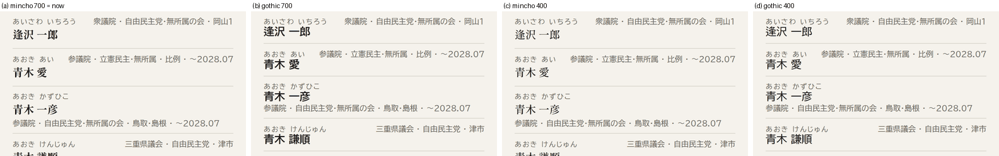
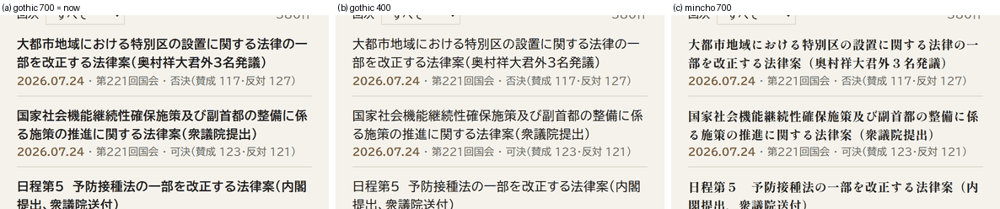

# 議員名・議案名の書体を転送量のために変えるか — 判断

Issue #453。`docs/research/font-transfer.md` §8-2 / §8-3 で切り出した2つの候補について、
**見た目を実際に並べて見たうえで判断した記録。**

## 結論（先に書く）

| 候補 | 判断 |
|---|---|
| **#8-3 `.members-item__name` の明朝（議員名）** | **変えるべきでない。** 設計方針に明文があり、見た目の損失が大きい |
| **#8-2 `.rollcalls-item a` の `font-weight: 700`（議案名）** | **変えるべき。** 設計方針に根拠が無く、見た目がほぼ変わらないまま −302 KB（−25%） |

**さらに、記録 `font-transfer.md` の見積もりに 2 箇所の誤りを見つけた**（§4）。
**いちばん大きいとされた候補3（−715 KB）は、そのままでは実現しない。**

---

## 1. 設計方針に何が書かれているか

**議員名を見出し家族で組むのは、明文化された意図的な決定である。**

デザイン方向「台帳」の決定（2026-08-22、ユーザー承認済み）に、こう書かれている:

> **見出し・氏名・数字: Shippori Mincho、本文: BIZ UDPGothic**、数字は tabular-nums

**「氏名」が名指しで挙がっている。**「見出し」の一種として巻き込まれたのではなく、
**独立した項目として書かれている。**

承認済みのワイヤーフレーム `design/wireframes/Search.dc.html`（`/members` にあたる画面）でも、
一覧の議員名は**明朝 700 で組まれている**:

```html
<!-- design/wireframes/Search.dc.html:43 -->
<div class="m" style="font-size: 19px; font-weight: 700; letter-spacing: 0.04em;">青木 愛</div>
<!-- .m は :14  font-family: 'Shippori Mincho', 'Hiragino Mincho ProN', 'Yu Mincho', serif -->
```

つまり**現行の `.members-item__name { font-family: var(--font-head); font-weight: 700; }` は、
承認された設計の忠実な実装である。**

### 議案名のほうには、そういう根拠が無い

同じワイヤーフレームの採決一覧（`design/wireframes/Votes.dc.html:52`）では、**議案名はゴシックで、
`font-weight` の指定が無い（＝ 400）**:

```html
<div style="font-size: 13px; line-height: 1.45;">日本国憲法の改正手続に関する法律の一部を改正する法律案</div>
```

現行の `font-weight: 700` は**設計から来ていない。**`git log -L` で追うと、
採決ページを最初に実装した **#33（`5b1a0d72`）で最初から 700 で書かれており**、
設計方針にも `docs/` にも、議案名を太字にする根拠は 1 行も無い。

**この差が、2つの候補の判断を分ける。**

---

## 2. 見た目（実際に描いて並べた）

本番（`https://gikailog.jp`）を 390px 幅で開き、`/fonts/fonts.css` のレスポンス本文に
比較用の宣言を追記して描かせた（§3 の測り方と同じ実行の中で撮っている）。
**`CSS.getPlatformFontsForNode` で、狙った face が実際に描いていることを毎回確認している。**

### `/members` の議員名



（左から (a) 現状=明朝700 / (b) ゴシック700 / (c) 明朝400 / (d) ゴシック400）

- **(a) 現状（明朝 700）** — 名前が行の中で明確に主役になっている。
  ふりがな・院・会派・選挙区はすべてゴシックなので、**家族が違うことで名前が浮き上がる。**
  「台帳」の性格（人の名前が記録の見出しである）が、書体の切り替えだけで出ている。
- **(b) ゴシック 700** — 階調は太さで残るが、**「台帳」の性格は消える。**
  名前もメタも同じ家族になり、よくある一覧アプリの見た目になる。
  設計方針の「色は構造と視線誘導に使う／点ではなく面で印象を作る」という組み立ての中で、
  **書体は名前を主役にする唯一の手段**であり、それを外すと行の性格が変わる。
- **(c) 明朝 400** — 家族は残るが、**名前が細くなってメタ情報との差が縮む。**
  17px の明朝 400 は、隣の 12px ゴシックに対して主役として弱い。
  現状との画素差は **1.0%**（§2-1）で、変化は小さいが**弱くなる方向の小ささ**である。
- **(d) ゴシック 400** — **いちばん転送量が減る案だが、いちばん見た目を失う。**
  名前とメタが同じ家族・同じウェイトになり、**行の中で名前がどれか一目で分からない。**

### `/rollcalls` の議案名



（左から (a) 現状=ゴシック700 / (b) ゴシック400 / (c) 明朝700）

- **(a) 現状（ゴシック 700）と (b) ゴシック 400 の差は、ほとんど分からない。**
  **改行位置も行数も行の高さも同一**で、変わるのは線の太さだけ。
  議案名は 14.5px で 2 行に渡る長文なので、**太さより「真鍮色の日付行との対比」で構造が出ている。**
  400 にしても議案名が主役であることは変わらない。
- **(c) 明朝 700** — 長い法律名を明朝の太字で 2 行組むと**字面が詰まって読みにくい。**
  括弧の見え方も変わる。**採用する理由が無い**（設計方針でも議案名はゴシック）。

### 2-1. 画素差（参考値）

同じ切り抜き（390×290 の CSS px）を画素比較した。

| 比較 | 差のある画素 |
|---|---:|
| `/members` (a) vs (b) ゴシック700 | 14.6% |
| `/members` (a) vs (c) 明朝400 | **1.0%** |
| `/members` (a) vs (d) ゴシック400 | 14.2% |
| `/rollcalls` (a) vs (b) ゴシック400 | **10.2%** |
| `/rollcalls` (a) vs (c) 明朝700 | 13.6% |

**この数字は単独では判断に使えない。**
`/members` の (b)(d) の 14% は**字幅が変わって行が上下にずれたぶん**を含んでいる
（明朝よりゴシックのほうが名前が短く出るので、以降の行が全部ずれる）。
一方 `/rollcalls` の (b) の 10.2% は**行が 1px も動いていない**（改行位置が同一）ので、
**純粋に線の太さだけの差**である。**同じ 10〜14% でも意味が違う。**

---

## 3. 転送量（実測）

`docs/research/font-transfer.md` §1 の測り方に従った:
本番を Playwright の Chromium、**390px 幅・ページごとに新しいコンテキスト（＝初回訪問）**、
`networkidle` → `document.fonts.ready` → 2.5 秒 → 再度 `fonts.ready` → 1.5 秒 待機。
サイズは **`response.body().length`**（**`content-length` は使っていない**）。
**各セル 3 回測り、下表はすべて 3 回とも同じ値になったもの。**

計測日: 2026-09-04。スクリプトは一時ファイルで、この PR には入れていない。

**比較用の宣言は `/fonts/fonts.css` のレスポンス本文の末尾に `!important` 付きで追記した。**
`fonts.css` は render-blocking で **woff2 より先に読まれる**ので、
**「元の face を読んだうえで追加で読む」ではなく「最初からその face で読む」**になる
（§5 の落とし穴を参照。最初はここを間違えた）。

### `/members`（現状 1,950 KB / 118件）

| 案 | 件数 | 合計 | 差 | 実際に描いた face |
|---|---:|---:|---:|---|
| **(a) 現状: 明朝 700** | 118件 | **1,950 KB** | — | Shippori Mincho |
| (b) ゴシック 700 | 123件 | **1,962 KB** | **+12 KB** | BIZ UDPGothic |
| (c) 明朝 400 | 123件 | **2,026 KB** | **+76 KB** | Shippori Mincho **Medium(500)** |
| (d) ゴシック 400 | 79件 | **1,326 KB** | **−624 KB（−32%）** | BIZ UDPGothic |

### `/rollcalls`（現状 1,190 KB / 82件）

| 案 | 件数 | 合計 | 差 | 実際に描いた face |
|---|---:|---:|---:|---|
| **(a) 現状: ゴシック 700** | 82件 | **1,190 KB** | — | BIZ UDPGothic |
| (b) ゴシック 400 | 60件 | **888 KB** | **−302 KB（−25%）** | BIZ UDPGothic |
| (c) 明朝 700 | 82件 | 1,204 KB | +14 KB | Shippori Mincho |

---

## 4. 記録 `font-transfer.md` の見積もりの誤り（2件）

**測って初めて分かったので、ここに残す。**

### 4-1. 候補3「−715 KB」は、ゴシック 700 では実現しない（**+12 KB になる**）

`font-transfer.md` §5-2 / §8-3 は「`.members-item__name` の `font-family: var(--font-head)` を
外すと、BIZ UDPGothic 400 と重複する 715 KB が消える」と書いている。
**「400 と重複する」ぶんが消えるのは、議員名を 400 で描いたときだけである。**

**現行は `font-weight: 700` も一緒に指定している。**`font-family` だけ外すと
**BIZ UDPGothic 700 になり、これは `/members` では他のどこにも使われていない新しい face** である
（現状の内訳に `biz-udpgothic-700` が 1 件も無いことで確認できる）。
結果、Shippori Mincho 700 の 1,090 KB が BIZ UDPGothic 700 の 1,008 KB に**置き換わるだけ**で、
重複は解消しない。**実測 1,950 → 1,962 KB。減らない。**

**−624 KB を取るには `font-weight` も 400 にする必要がある**（＝上の (d)）。
そしてそれは §2 のとおり**いちばん見た目を失う案**である。
**「いちばん大きい効果」と「いちばん大きい見た目の損失」は同じ案だった。**

### 4-2. `Shippori Mincho 500` は「使われていない」と言い切れない

`font-transfer.md` §5-3 / §8-1 は「500 は 3 ページのどこにも出てこなかったので
`FONT_FAMILIES` から外せる」と書き、**その注意書きどおりの反例が出た。**

`.members-item__name` を **明朝 400** にした (c) で、ブラウザが選んだのは
**`Shippori Mincho Medium`（＝ 500）** だった（`CSS.getPlatformFontsForNode` の
`familyName` が `Shippori Mincho Medium`。転送も `shippori-mincho-500` が 62件 1,072 KB）。
**Shippori Mincho は 400 の face を持たないので、400 を要求すると 500 が選ばれる。**

**#8-1（500 を外す）を実施するなら、`font-weight: 400`（または未指定）で
`--font-head` を使っている箇所が無いことを先に確認すること。**
現状は無い（`--font-head` を使う **34 箇所すべてが 700 か 800** を指定している。
`grep -rn "var(--font-head)" apps/web/app/` の 34 件を 1 件ずつ確認した。
`Stamp.tsx:28` だけ `fontWeight` が別行にあるが、`:30` で 700 を指定している）が、
**将来 `--font-head` を weight 指定なしで書いた瞬間に 500 が読まれる。**

---

## 5. 測り方の落とし穴（`font-transfer.md` §1 に足すもの）

**比較用の CSS を「あとから」入れると、差分ではなく合計を測ってしまう。**

最初は `page.addInitScript` で `<style>` を差し込んだ。これだと
**元の face を読み終わったあとに宣言が効く**ので、
`/rollcalls` のゴシック400案が **1,190 → 1,683 KB（増加）** という無意味な値になった
（400 の 55 スライスが、元の 700 の 55 スライスに**足された**）。

**`/fonts/fonts.css` のレスポンス本文に追記する**と、render-blocking な CSS の中に入るので
フォント選択より先に効く。加えて**ルート CSS が後から同じ詳細度で上書きしてくる**ので、
**`!important` が要る**（付けずに測った回は `painted` が元の face のままで、
`/members` の 3 案がすべて 1,950 KB という「変化なし」の値になった）。

**`CSS.getPlatformFontsForNode` で狙った face が描いていることを毎回確認すること。**
これを見ていなければ、上の 2 つの失敗はどちらも「差が無かった」という結論として通ってしまった。

---

## 6. 判断

### 6-1. 議員名（`.members-item__name`）— **変えるべきでない**

**理由（見た目）:** 議員名を明朝で組むのは、**承認済みの設計方針に「氏名」と名指しで書かれた決定**であり、
ワイヤーフレームでもそう組まれている（§1）。
このサイトで名前は最も重要な情報で、**書体の切り替えが、行の中で名前を主役にしている唯一の手段**である
（色は「構造と視線誘導」に使う、と方針が定めているので、名前を色で立てる選択肢は無い）。
(b)(d) はその性格を失い、(c) は名前を弱くする（§2）。

**理由（数字）:** そもそも**期待されていた −715 KB は出ない。**
`font-family` だけ外す (b) は **+12 KB**、`font-weight` も落とす (d) でようやく −624 KB だが、
**(d) は 4 案の中で最も見た目を損なう**（§4-1）。
**「いちばん大きい効果」は「いちばん大きい損失」と同じ案**なので、
**「軽くなるぶんだけ見た目を諦める」という交換が成り立っていない。**

**残る 1,090 KB は受け入れる。**`font-display: swap` で描画は止まっておらず
（`font-transfer.md` §3、FCP 時点で woff2 は 0 件到着）、**初回描画は遅れていない。**
`/members` を軽くしたいなら、書体ではなく**折りたたみの件数**（`font-transfer.md` §6:
1 回の展開で +1,067 KB）のほうが素直な手段である。

### 6-2. 議案名（`.rollcalls-item a` の `font-weight: 700`）— **変えるべき**

**理由（見た目）:** **設計方針にもワイヤーフレームにも、議案名を太字にする根拠が無い。**
むしろワイヤーフレームは**ゴシック 400 で組んでいる**（§1）。
現行の 700 は #33 の実装時に入ったもので、**設計判断ではない。**
そして (a) と (b) は**改行位置も行数も行高も同一で、線の太さしか変わらない**（§2）。
**失う見た目が無い**（正確には「設計が指定していたほうに戻る」）。

**理由（数字）:** **1,190 → 888 KB（−302 KB, −25%）。3 回とも同じ値。**
議案名は `/rollcalls` で最も字種が多い（763 字中 722 字）ので、
**太字をやめると 55 スライスが本文の 400 と丸ごと共有される**（読むスライスが 82 → 60 件）。

**これは「軽くなるから変える」ではない。**
**「設計が指定していない太字が付いていて、外すと設計どおりになり、ついでに 25% 軽くなる」**である。

**この PBI では変えない。実装は別 issue に切り出す**（受け入れ条件のとおり）。

### 6-3. PO/ユーザーの判断を仰ぐか

**仰がない。** 2 件とも**設計方針の明文に照らして機械的に決まった**ので、
新しいデザイン判断をしていない:

- 議員名は方針が**「氏名は Shippori Mincho」と書いている** → 変えない
- 議案名は方針が**ゴシック 400 と示している** → **現行のほうが方針から外れている**ので戻す

**ただし §6-2 の実装 issue はワイヤーフレームの解釈に依っている**（「`font-weight` の指定が無い」を
「400 が意図」と読んだ）。**もし議案名の太字が意図的なものだったなら、この判断は変わる。**
実装 issue のレビューで、そこだけ確認してほしい。

---

## 7. この判断が変わる条件

- **`.members-item__name` の `font-weight` を 400 にする**別の理由ができたとき。
  そのときは Shippori Mincho 500 が読まれる（§4-2）ので、#8-1（500 を外す）とは両立しない。
- **`--font-head` を weight 指定なしで使い始めた**とき。同じく 500 が読まれる。
- **議案名に太字が必要だという設計判断が出た**とき。§6-2 の前提が崩れる。
- **`/rollcalls` の他の要素が BIZ UDPGothic 700 を使い始めた**とき。
  §6-2 の −302 KB は「700 を読むのが議案名だけ」だから出ている
  （現状 700 は 55 件中 54 件が議案名のスライス。400 化後も 1 件だけ残る）。
